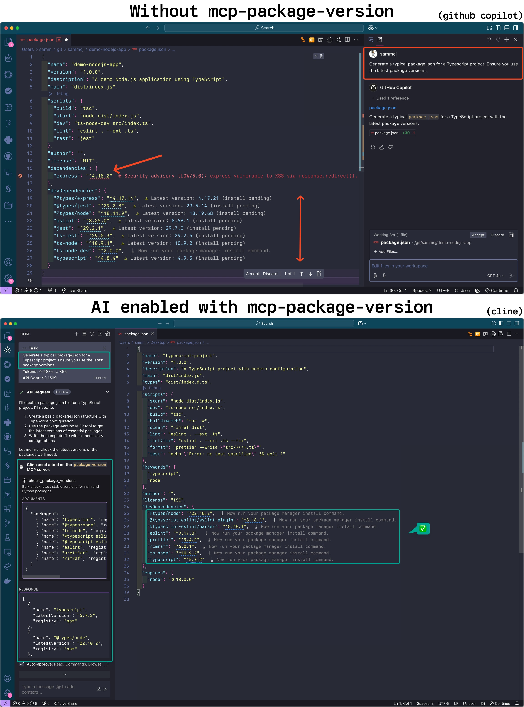

# Package Version MCP Server

[](https://smithery.ai/server/mcp-package-version)

An MCP server that provides tools for checking latest stable package versions from multiple package registries:

- npm (Node.js/JavaScript)
- PyPI (Python)
- Maven Central (Java)
- Go Proxy (Go)
- Crates.io (Rust)
- pub.dev (Dart/Flutter)
- Swift Packages (Swift)
- AWS Bedrock (AI Models)
- Docker Hub (Container Images)
- GitHub Container Registry (Container Images)
- GitHub Actions

This server helps LLMs ensure they're recommending up-to-date package versions when writing code.

**IMPORTANT: I'm slowly moving across this tool to a component of my [mcp-devtools](https://github.com/sammcj/mcp-devtools) server**

<a href="https://glama.ai/mcp/servers/zkts2w92ba"></a>

Now with support for Rust crates!

## Screenshot



- [Package Version MCP Server](#package-version-mcp-server)
  - [Screenshot](#screenshot)
  - [Installation](#installation)
  - [Usage](#usage)
  - [Tools](#tools)
  - [Releases and CI/CD](#releases-and-cicd)
  - [License](#license)

## Installation

Requirements:

- A modern go version installed (See [Go Installation](https://go.dev/doc/install))

Using `go install` (Recommended for MCP Client Setup):

```bash
go install github.com/sammcj/mcp-package-version/v2@HEAD
```

Then setup your client to use the MCP server. Assuming you've installed the binary with `go install github.com/sammcj/mcp-package-version/v2@HEAD` and your `$GOPATH` is `/Users/sammcj/go/bin`, you can provide the full path to the binary:

```json
{
  "mcpServers": {
    "package-version": {
      "command": "/Users/sammcj/go/bin/mcp-package-version"
    }
  }
}
```

- For the Cline VSCode Extension this will be `~/Library/Application Support/Code/User/globalStorage/saoudrizwan.claude-dev/settings/cline_mcp_settings.json`
- For Claude Desktop `~/Library/Application\ Support/Claude/claude_desktop_config.json`
- For GoMCP `~/.config/gomcp/config.yaml`

### Other Installation Methods

Or clone the repository and build it:

```bash
git clone https://github.com/sammcj/mcp-package-version.git
cd mcp-package-version
make
```

You can also run the server in a container:

```bash
docker run -p 18080:18080 ghcr.io/sammcj/mcp-package-version:main
```

Note: If running in a container, you'll need to configure the client to use the URL instead of command, e.g.:

```json
{
  "mcpServers": {
    "package-version": {
      "url": "http://localhost:18080",
    }
  }
}
```

#### Tip: Go Path

If `$GOPATH/bin` is not in your `PATH`, you'll need to provide the full path to the binary when configuring your MCP client (e.g. `/Users/sammcj/go/bin/mcp-package-version`).

If you haven't used go applications before and have only just installed go, you may not have a `$GOPATH` set up in your environment. This is important for any `go install` command to work correctly.

> **Understanding `$GOPATH`**
>
> The `go install` command downloads and compiles Go packages, placing the resulting binary executable in the `bin` subdirectory of your `$GOPATH`. By default, `$GOPATH` is > usually located at `$HOME/go` on Unix-like systems (including macOS). If you haven't configured `$GOPATH` explicitly, Go uses this default.
>
> The location `$GOPATH/bin` (e.g., `/Users/your_username/go/bin`) needs to be included in your system's `PATH` environment variable if you want to run installed Go binaries directly by name from any terminal location.
>
> You can add the following line to your shell configuration file (e.g., `~/.zshrc`, `~/.bashrc`) to set `$GOPATH` to the default if it's not already set, and ensure `$GOPATH/bin` is in your `PATH`:
>
> ```bash
> [ -z "$GOPATH" ] && export GOPATH="$HOME/go"; echo "$PATH" | grep -q ":$GOPATH/bin" || export PATH="$PATH:$GOPATH/bin"
> ```
>
> After adding this line, restart your terminal or MCP client.

## Usage

The server supports two transport modes: stdio (default) and SSE (Server-Sent Events).

### STDIO Transport (Default)

```bash
mcp-package-version
```

### SSE Transport

```bash
mcp-package-version --transport sse --port 18080 --base-url "http://localhost:18080"
```

This would make the server available to clients at `http://localhost:18080/sse` (Note the `/sse` suffix!).

#### Command-line Options

- `--transport`, `-t`: Transport type (stdio or sse). Default: stdio
- `--port`: Port to use for SSE transport. Default: 18080
- `--base-url`: Base URL for SSE transport. Default: http://localhost

### Docker Images

Docker images are available from GitHub Container Registry:

```bash
docker pull ghcr.io/sammcj/mcp-package-version:main
```

You can also see the example [docker-compose.yaml](docker-compose.yaml).

## Tools

### NPM Packages

Check the latest versions of NPM packages:

```json
{
  "name": "check_npm_versions",
  "arguments": {
    "dependencies": {
      "react": "^17.0.2",
      "react-dom": "^17.0.2",
      "lodash": "4.17.21"
    },
    "constraints": {
      "react": {
        "majorVersion": 17
      }
    }
  }
}
```

### Python Packages (requirements.txt)

Check the latest versions of Python packages from requirements.txt:

```json
{
  "name": "check_python_versions",
  "arguments": {
    "requirements": [
      "requests==2.28.1",
      "flask>=2.0.0",
      "numpy"
    ]
  }
}
```

### Python Packages (pyproject.toml)

Check the latest versions of Python packages from pyproject.toml:

```json
{
  "name": "check_pyproject_versions",
  "arguments": {
    "dependencies": {
      "dependencies": {
        "requests": "^2.28.1",
        "flask": ">=2.0.0"
      },
      "optional-dependencies": {
        "dev": {
          "pytest": "^7.0.0"
        }
      },
      "dev-dependencies": {
        "black": "^22.6.0"
      }
    }
  }
}
```

### Java Packages (Maven)

Check the latest versions of Java packages from Maven:

```json
{
  "name": "check_maven_versions",
  "arguments": {
    "dependencies": [
      {
        "groupId": "org.springframework.boot",
        "artifactId": "spring-boot-starter-web",
        "version": "2.7.0"
      },
      {
        "groupId": "com.google.guava",
        "artifactId": "guava",
        "version": "31.1-jre"
      }
    ]
  }
}
```

### Java Packages (Gradle)

Check the latest versions of Java packages from Gradle:

```json
{
  "name": "check_gradle_versions",
  "arguments": {
    "dependencies": [
      {
        "configuration": "implementation",
        "group": "org.springframework.boot",
        "name": "spring-boot-starter-web",
        "version": "2.7.0"
      },
      {
        "configuration": "testImplementation",
        "group": "junit",
        "name": "junit",
        "version": "4.13.2"
      }
    ]
  }
}
```

### Go Packages

Check the latest versions of Go packages from go.mod:

```json
{
  "name": "check_go_versions",
  "arguments": {
    "dependencies": {
      "module": "github.com/example/mymodule",
      "require": [
        {
          "path": "github.com/gorilla/mux",
          "version": "v1.8.0"
        },
        {
          "path": "github.com/spf13/cobra",
          "version": "v1.5.0"
        }
      ]
    }
  }
}
```

### Rust Packages

Check the latest versions of Rust crates from Cargo.toml:

```json
{
  "name": "check_rust_versions",
  "arguments": {
    "dependencies": {
      "serde": "1.0.136",
      "tokio": "1.17.0",
      "rocket": "0.5.0-rc.1",
      "clap": { 
        "version": "3.1.0",
        "features": ["derive", "cargo"]
      },
      "log": {
        "version": "0.4.17",
        "optional": true
      }
    }
  }
}
```

### Dart Packages

Check the latest versions of Dart packages from pubspec.yaml:

```json
{
  "name": "check_dart_versions",
  "arguments": {
    "dependencies": {
      "flutter": "sdk: flutter",
      "http": "^0.13.4",
      "provider": "^6.0.2",
      "firebase_core": "^1.12.0",
      "shared_preferences": {
        "version": "^2.0.13"
      }
    }
  }
}
```

### Docker Images

Check available tags for Docker images:

```json
{
  "name": "check_docker_tags",
  "arguments": {
    "image": "nginx",
    "registry": "dockerhub",
    "limit": 5,
    "filterTags": ["^1\\."],
    "includeDigest": true
  }
}
```

### AWS Bedrock Models

List all AWS Bedrock models:

```json
{
  "name": "check_bedrock_models",
  "arguments": {
    "action": "list"
  }
}
```

Search for specific AWS Bedrock models:

```json
{
  "name": "check_bedrock_models",
  "arguments": {
    "action": "search",
    "query": "claude",
    "provider": "anthropic"
  }
}
```

Get the latest Claude Sonnet model:

```json
{
  "name": "get_latest_bedrock_model",
  "arguments": {}
}
```

### Swift Packages

Check the latest versions of Swift packages:

```json
{
  "name": "check_swift_versions",
  "arguments": {
    "dependencies": [
      {
        "url": "https://github.com/apple/swift-argument-parser",
        "version": "1.1.4"
      },
      {
        "url": "https://github.com/vapor/vapor",
        "version": "4.65.1"
      }
    ],
    "constraints": {
      "https://github.com/apple/swift-argument-parser": {
        "majorVersion": 1
      }
    }
  }
}
```

### GitHub Actions

Check the latest versions of GitHub Actions:

```json
{
  "name": "check_github_actions",
  "arguments": {
    "actions": [
      {
        "owner": "actions",
        "repo": "checkout",
        "currentVersion": "v3"
      },
      {
        "owner": "actions",
        "repo": "setup-node",
        "currentVersion": "v3"
      }
    ],
    "includeDetails": true
  }
}
```

## Releases and CI/CD

This project uses GitHub Actions for continuous integration and deployment. The workflow automatically:

1. Builds and tests the application on every push to the main branch and pull requests
2. Creates a release when a tag with the format `v*` (e.g., `v1.0.0`) is pushed
3. Builds and pushes Docker images to GitHub Container Registry

## License

[MIT](LICENSE)
